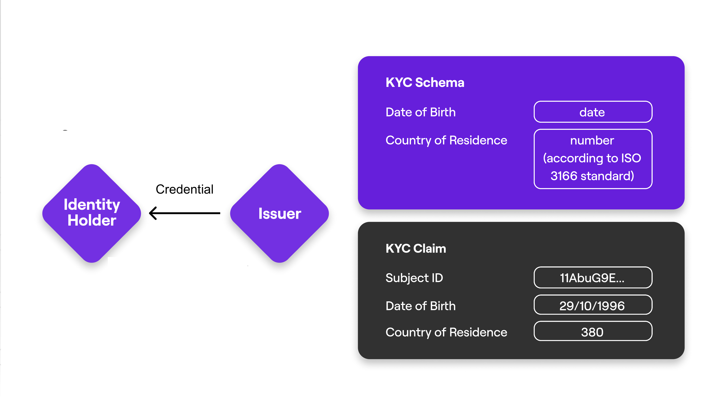
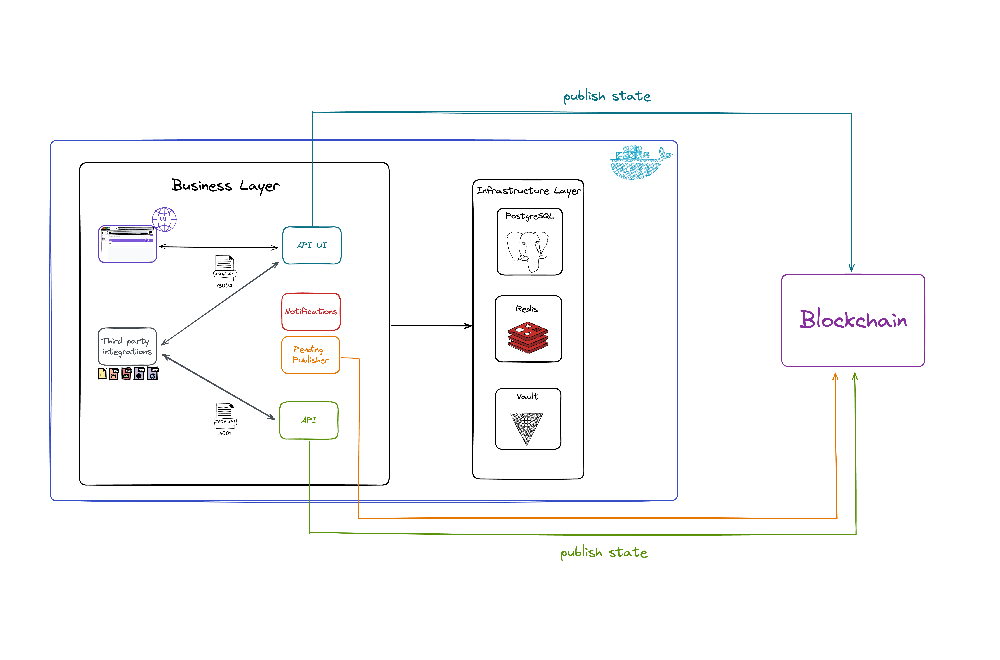
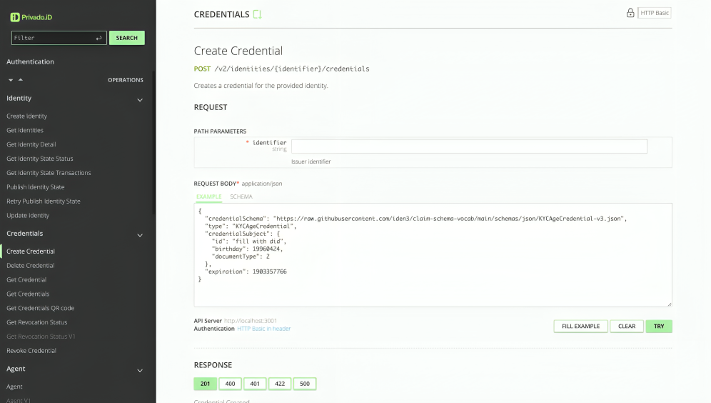
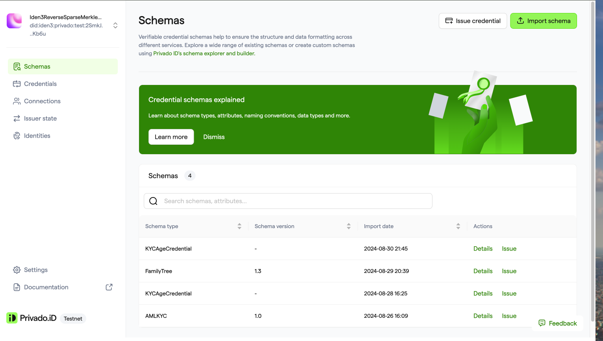

An Issuer is any subject that issues Verifiable Credentials. You can think of a credential as a statement: something an Issuer says about another subject. For example, when a university (Issuer) claims that a student (subject) has a degree, this is a credential.

An issuer might be:

- A DAO that issues “membership claims" to its members.
- A Government institution that issues Identity documents to its citizens.
- A Face detection Machine Learning application that issues "proof of personhood" claims.
- An employer that endorses its employees.

> [<ins>Verifiable Credentials</ins>](https://www.w3.org/TR/vc-data-model/) are a flexible data format able to express any type of information so that developers can unleash their creativity.

# Operating an issuer

There are some different ways one can perform issuer-related actions, that is, manage and issue credentials, establish connections with holders etc. These are the currently available options:

- Running an Issuer Node directly in your infrastructure. Find a ready to use helm chart in the [opid-issuer-gcloud repo](https://github.com/wakeuplabs-io/opid-issuer-gcloud)

- Adapting the [JS SDK](/docs/js-sdk/js-sdk-overview.md) to your application that issues credentials.

- Making use of Optimism ID smart contracts for [on-chain issuance](https://github.com/wakeuplabs-io/opid-contracts-examples/blob/f60e8b8adf1f868722c4a7aa49b33a1df14117b6/contracts/examples/IdentityExample.sol).

## Issuer Nodes

To operate, an Issuer must run an Issuer Node, which is a self-hosted Node that exposes all the functionalities necessary to run an issuer.

  

There are basically two ways the Issuer Node can be implemented:

- Issuer Node Core API
- Issuer Node UI

### Issuer Node Core API

The Issuer Node Core API is ideal for users who need multiple identities and for **integrator profiles, who want to create solutions based on Optimism ID functionalities and might be interested in having access to low-level information** such as Merkle Trees.

### Issuer Node UI

The Issuer Node UI provides the full experience of having an Issuer Node with all its capabilities. Although it offers only a single identity, it also presents a few extra features, such as establishing connections and importing schemas. It comes in an API format but there is also the possibility of generating a full-fledged user interface.

Issuer Node User Interface with a more visual experience:

Issuer Node API UI with Managing Schemas, Credentials and other functionalities:

## Disclosure

[opid-issuer-node](https://github.com/wakeuplabs-io/opid-issuer-node) is a fork from PrivadoID's [issuer-node](https://github.com/0xPolygonID/issuer-node) specifically tailored to work for optimism with the `opid` method.

You can find more documentation on [privado id documentation](https://github.com/0xPolygonID/docs/tree/4659c93cd9835e444ffc55a577bd6ab0db1e4811/docs/issuer-node) methods and procedures should remain the same with the exception that `opid-issuer-node` supports optimism out of the box.

