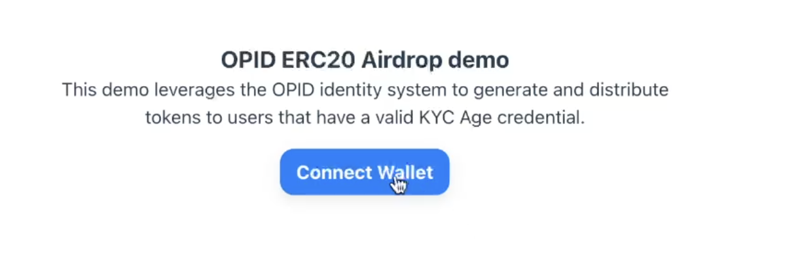
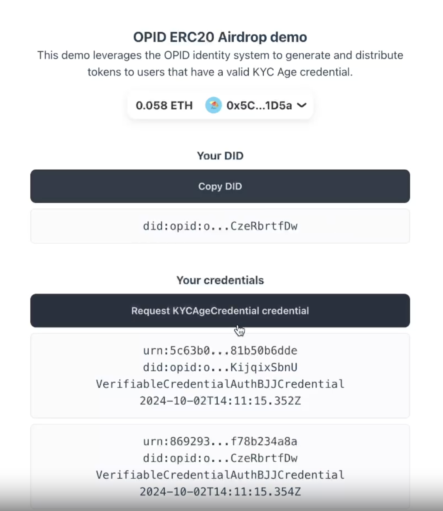
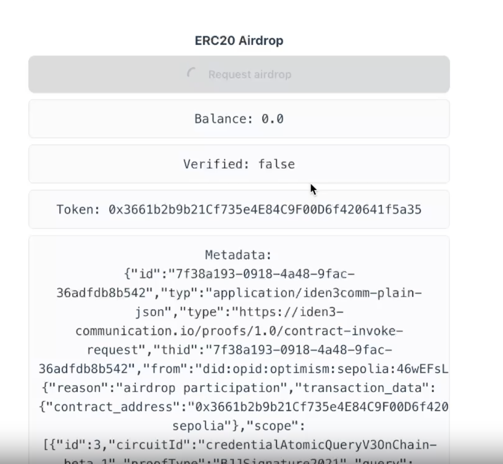

This tutorial is a quick demonstration of some of Privado ID's main functionalities. To illustrate how Privado ID works, we will walk you through some of its products and tools by following along a simple POAP use case.
POAP stands for Proof of Attendance Protocol, which is used to prove that someone has taken part in a given event.

This guide will briefly touch on the 3 roles of the Triangle of Trust, namely the Identity Holder, the Issuer and the Verifier. For that, we will take the case of an individual who needs to prove that they were able to participate in a particular event.

The demo covers the following steps:

1. Create a OpId DID for the user
2. Issue a new credential to attest to user age
3. Fetch the newly created credential
4. Verify the credential validity and create a proof to claim an airdrop

## Source code

The repo for the following demo can be found here: 
- https://github.com/wakeuplabs-io/opid-demo

And the erc20 airdrop contract is from here:
- https://github.com/wakeuplabs-io/opid-contracts-examples

In this case we used the [Issuer Node](https://github.com/wakeuplabs-io/opid-issuer-node) to issue the credentials on chain. To remove complexity not associated to the demo we just assumed everyone who claims is worthy of the credential (most likely not the case in a real world scenario).

Example deployments can be found here:
- Demo -> http://opid-demo.wakeuplabs.link.s3-website-us-east-1.amazonaws.com/
- Issuer -> http://api.34.54.152.126.nip.io/
- UI Api -> http://app.34.54.152.126.nip.io/
- UI -> http://ui.34.54.152.126.nip.io/
- RHS -> http://a5b04b3407e4a4aaaa0dfb9fae5f56ea-5d593b240f465f95.elb.us-east-1.amazonaws.com

## Erc20 Airdrop demo

1. Connect your wallet. For this demo the website creates a wallet on the spot and keeps the credentials stored locally

2. Claim your credential

3. Request the airdrop

